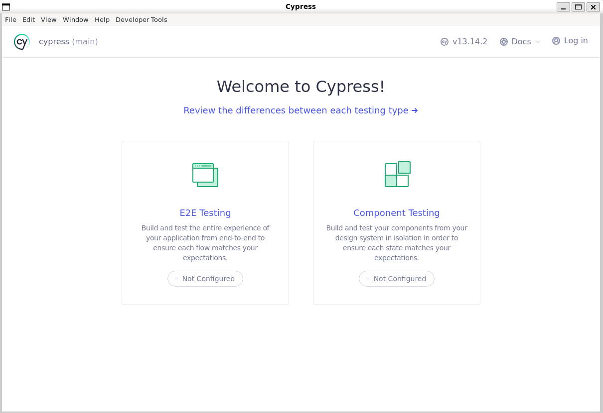
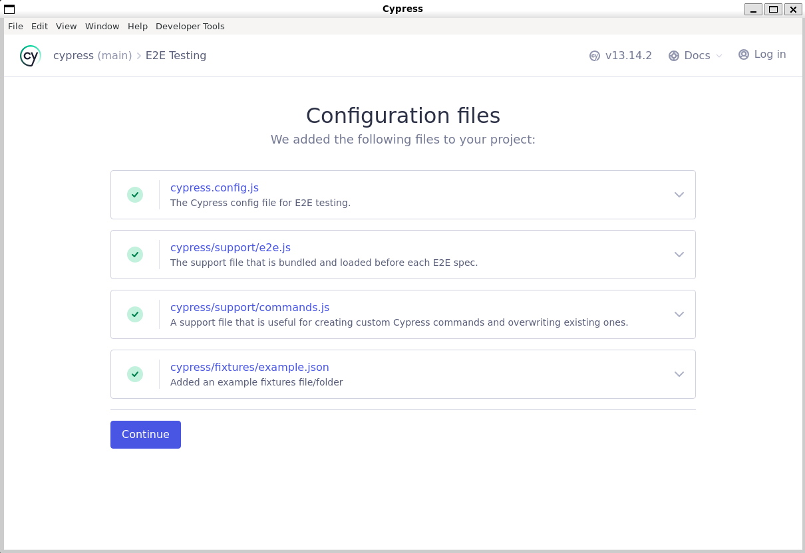
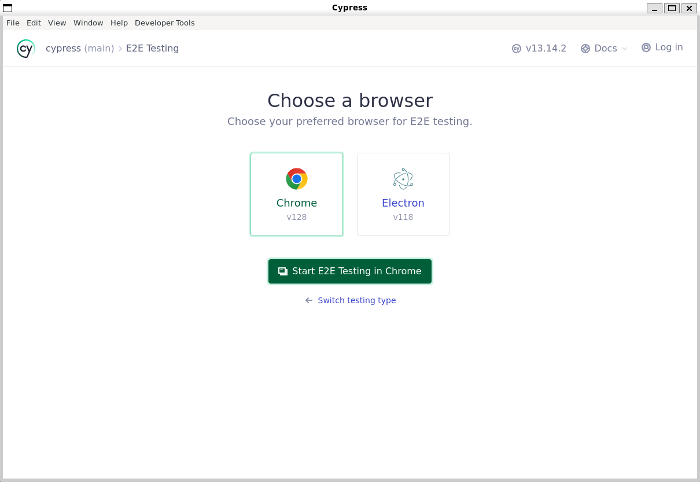
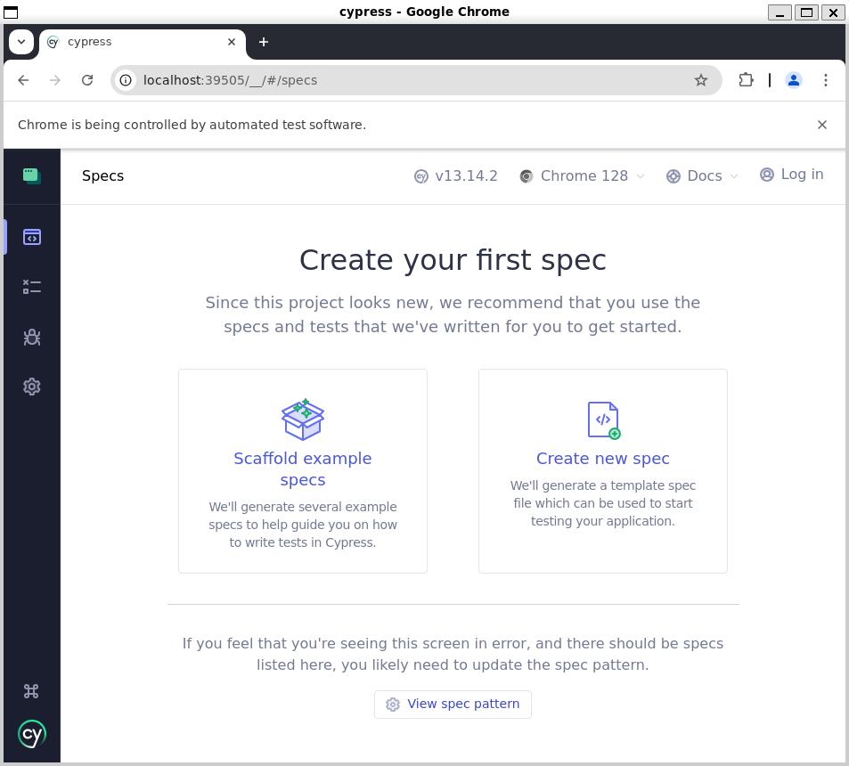
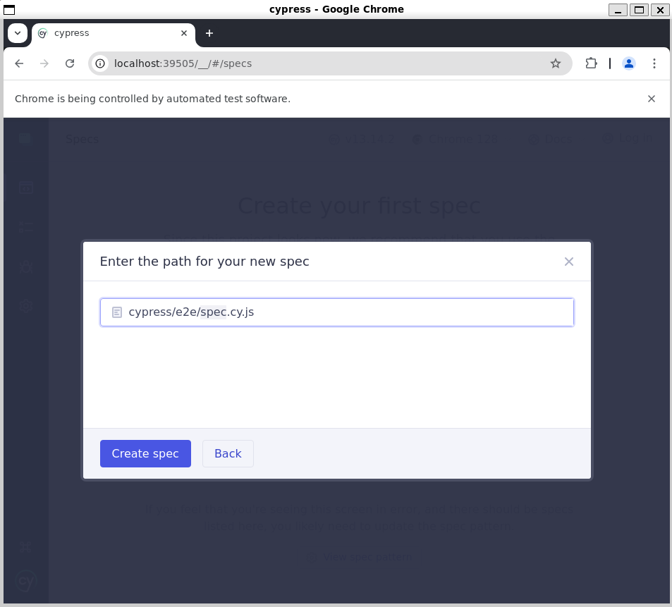
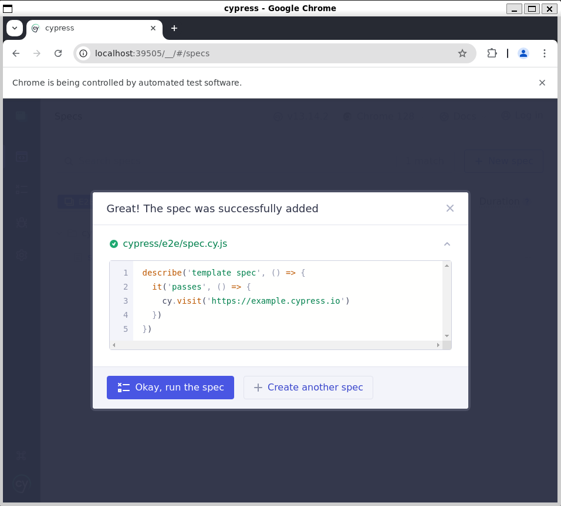
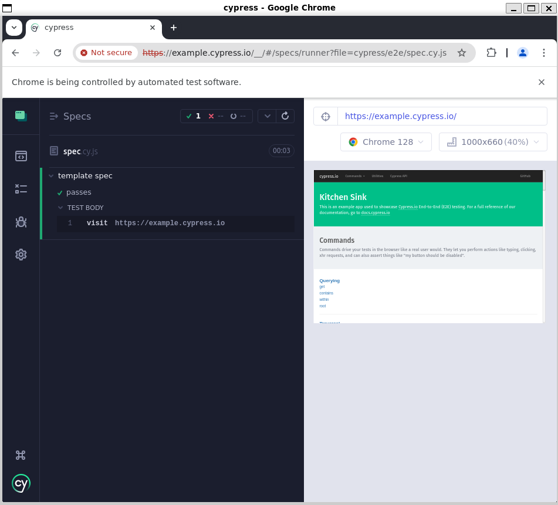

# Instalando o Cypress

```bash
npm install cypress --save-dev
```

Vai instalar as dependências

- package-lock.json
- package.json

## Inciando o Cypress

```bash
    npx cypress open
```

## Tela de Boas-Vindas !!!

Escolha o opção `E2E Testing`

<div align="center">



</div>

## Ao escolher a opção, E2E Testing, será criada a pasta cypress

<div align="center">



</div>

## Escolher o Browser

<div align="center">



</div>

## Criar um novo spec

<div align="center">



</div>

## Nome do teste

<div align="center">



</div>

## Exemplo de um teste

<div align="center">



</div>

## Executando o teste

<div align="center">



</div>

## Se for um projeto que já existe...

Instalar as dependências

```bash
npm install
```

Iniciando o projeto

```bash
npm init -y
```

## Extensão no VSCODE

Cypress Snippets v2